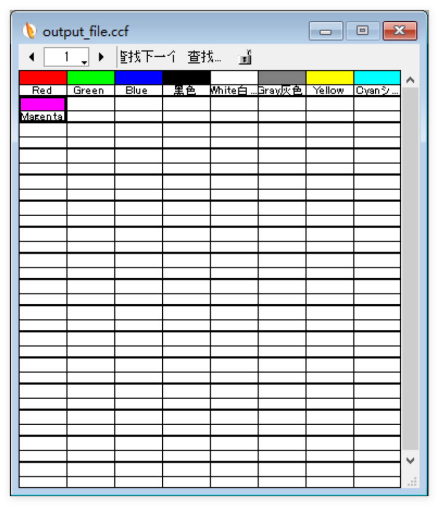

[日本語](README.md) | [中文](README_zh.md)
# Paintman 颜色表文件 (CCF) 生成・读取程序

## 概述
- 该项目由两个Python程序组成，用于创建和读取Paintman颜色表文件（CCF）。`generate_ccf.py` 用于从指定的颜色数据生成CCF文件，`read_ccf.py` 用于读取生成的CCF文件并输出颜色信息。
- 在README的最后，我对CCF文件的结构进行了解析。

---

## 文件结构
1. **`generate_ccf.py`**：生成颜色表文件（CCF）的程序。
2. **`read_ccf.py`**：读取CCF文件并输出颜色名称和RGB值的程序。

---

## `generate_ccf.py` 的说明
### 概述
这个程序可以从包含RGB值和颜色名称的数据生成颜色表文件（CCF）。RGB值将从8位转换为16位，颜色名称将使用 ASCII 或 EUC 编码。

### 使用方法
1. 在 `example_color_data` 中定义包含RGB值和颜色名称的元组列表。
2. 创建 `ColorChartFile` 类的实例，并使用 `create_ccf_file` 方法生成CCF文件。
3. 生成的文件将保存在指定的路径。
4. 生成的文件可以用 `read_ccf.py` 读取。也可以在Paintman中打开。


### 代码说明
- **`dec_to_hex_byte` 方法**：将十进制值转换为1字节的十六进制数。
- **`encode_label` 方法**：对颜色名称进行编码，英文数字和符号使用ASCII编码，中文和日语等使用EUC编码。
- **`add_color_block` 方法**：将RGB值和颜色名称添加到字节数组，并整理成16字节的块。
- **`fill_to_target_length` 方法**：将字节数组填充到指定的长度。
- **`create_ccf_file` 方法**：创建并保存CCF文件。

---

## `read_ccf.py` 的说明
### 概述
这个程序用于读取CCF文件，并输出每种颜色的RGB值和颜色名称。16位的RGB值在显示时将转换为8位。

### 使用方法
1. 指定要读取的CCF文件的路径。
2. 创建 `CCFFileReader` 类的实例，并使用 `read_ccf_file` 方法获取颜色数据。
3. 将输出每种颜色的名称和8位RGB值。

### 代码说明
- **`hex_byte_to_dec` 方法**：将十六进制字节转换为十进制。
- **`decode_label` 方法**：解码颜色名称，英文数字使用ASCII解码，日语用`EUC-JP`、中文用`EUC-CN` (兼容GB2312) 解码。
- **`read_ccf_file` 方法**：读取CCF文件并返回颜色数据列表。

---

## 程序执行结果
1. 执行 **`generate_ccf.py`** 后，将生成包含指定RGB值和颜色名称的CCF文件，并显示文件路径。
2. 执行 **`read_ccf.py`** 后，将读取CCF文件，并在控制台显示每种颜色的名称和8位RGB值，同时输出总颜色数。

---

## 使用示例
下列输出是中文译文
### `generate_ccf.py`
```plaintext
CCF文件已创建在 /path/to/your/directory/output_file.ccf。
```

### `read_ccf.py`
```plaintext
标签：Red 	8位 RGB：(255, 0, 0)
标签：Green 	8位 RGB：(0, 255, 0)
标签：Blue 	8位 RGB：(0, 0, 255)
标签：黑色 	8位 RGB：(0, 0, 0)
标签：White白色 	8位 RGB：(255, 255, 255)
标签：Gray灰色 	8位 RGB：(128, 128, 128)
标签：Yellow 	8位 RGB：(255, 255, 0)
标签：Cyan 	8位 RGB：(0, 255, 255)
标签：Magenta 	8位 RGB：(255, 0, 255)
共找到 9 种颜色。
```

---

## 注意事项
1. 标签编码时，英文数字和符号使用ASCII编码，中文和日语使用EUC编码。如果标签超过15字节将被截断。
2. RGB值以16位格式保存，在读取时转换为8位。

---
## CCF文件结构解析

#### 文件介绍
- **扩展名**：`*.ccf`
- CCF文件是Retas Studio系列中Paintman的颜色表文件，用于保存颜色数据。
- CCF文件是二进制文件，每个文件包含1280个颜色数据块，每个颜色数据块由6字节的RGB数据和16字节的编码标签组成。

#### 文件头部
- **头部开始 (SOH)**：文件以`00`字节开始，随后是`64`。`64`可能表示特定的格式标识符或版本号。

#### 颜色数据块
每个颜色数据块包含以下部分：
- **颜色值**：6字节 RGB的每个分量以16位RGB表示，如果是8位RGB，则看起来会是每个字节被重复保存。
  - 例如：8位颜色`#C5E8F6`被保存为`C5 C5 E8 E8 F6 F6`。
- **标签长度**：1字节 在每个颜色块之后，后续标签的字节数会用1字节保存。比如标签为“NOR”`4E 4F 52`，则标签长度的值为`03`
- **标签**：16字节 在标签长度值之后，标签中的英文数字符号以`ASCII`编码保存，日语以`EUC-JP`、中文以`EUC-CN` (兼容GB2312) 编码保存。
    - 例如：“NOR”`4E 4F 52`、“普通”`C6 D5 CD A8`、“あか”`A4 A2 A4 AB`。
- **填充**：标签后的剩余字节被`00`填充，使标签和填充总共达到16字节。

#### 文件的填充
- 在填充指定的颜色数据块后，剩余空间被以下模式填充直到`0x6E01`：
  - 白色（`FF FF FF FF FF FF`）、无标签（`''`），然后被`00`填充直到16字节。
  - 此模式一直重复到文件末尾。
  - 总共1280种颜色，分为10页在Paintman中显示。

#### 文件末尾
- 文件长度应精确为`0x6E01`字节。

---
## 许可证
- MIT许可证

## 其他
- 关于CCF文件结构解析，如果有错误或改进点，请创建Issue。
